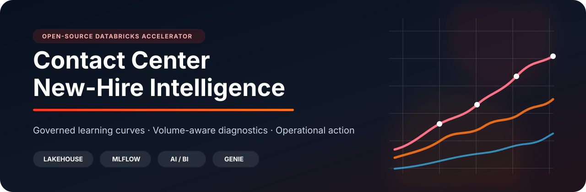
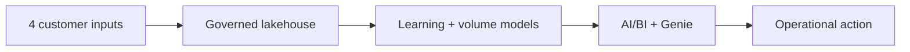
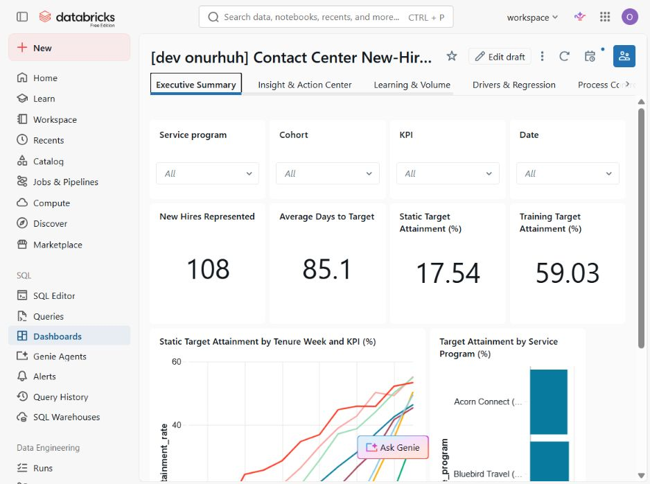
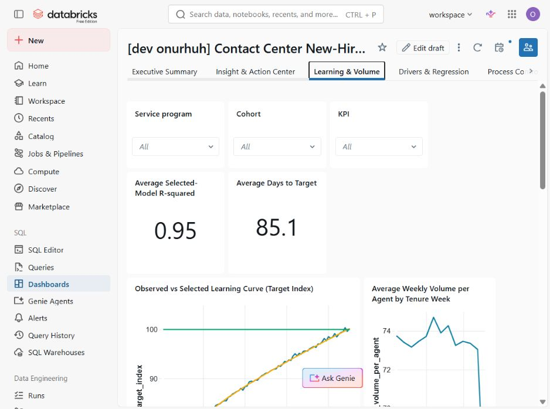
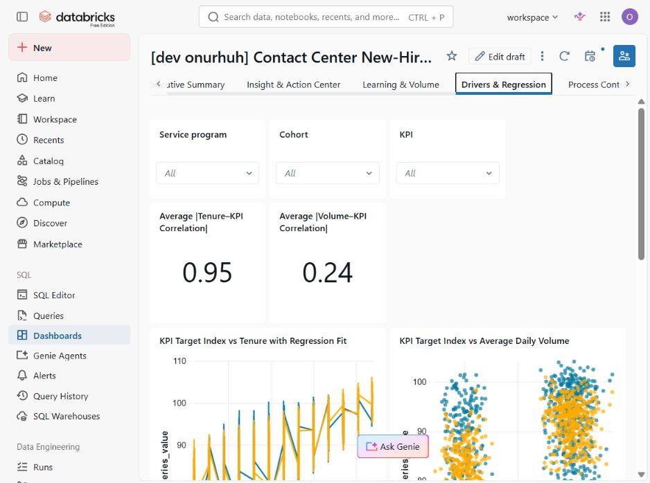
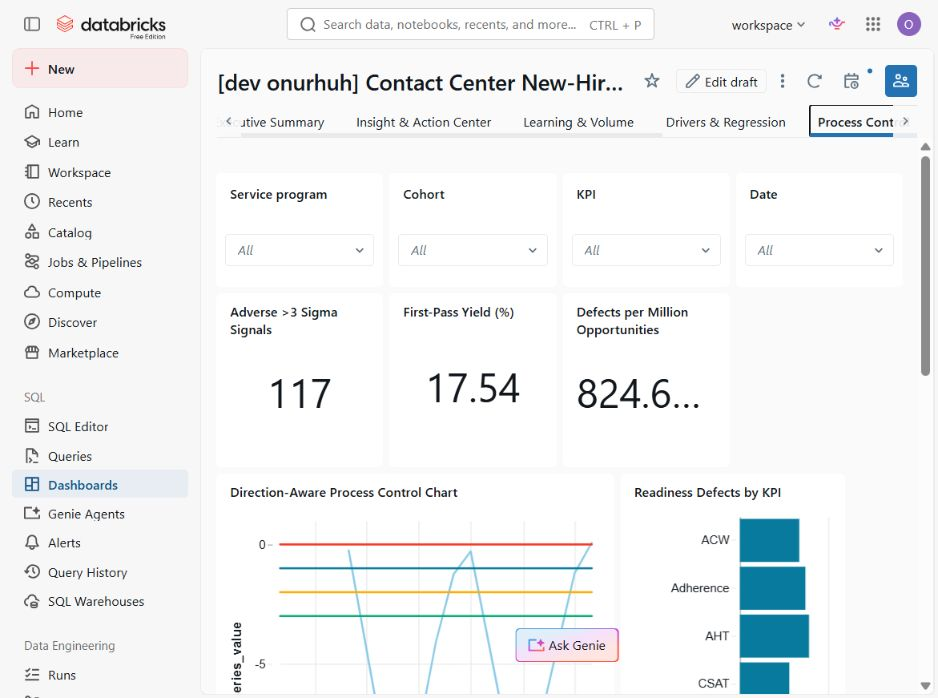
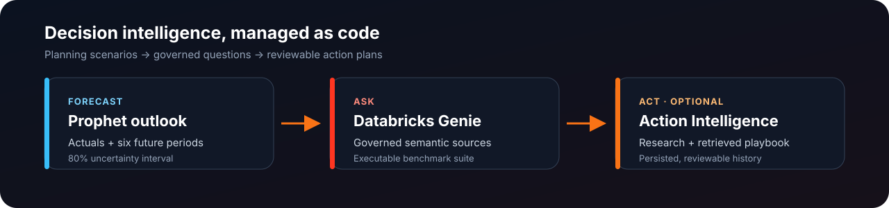
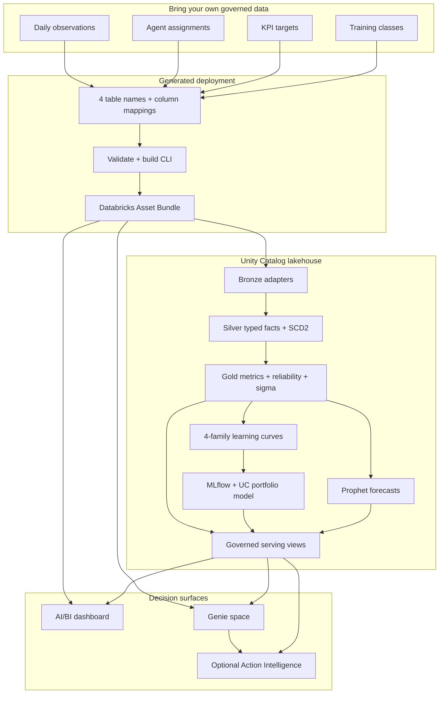

<div align="center">
  
</div>

<div align="center">

[](https://github.com/soulipaco/contact-center-new-hire-intelligence/actions/workflows/ci.yml)
[](https://www.python.org/)
[](https://docs.databricks.com/en/dev-tools/bundles/)
[](https://mlflow.org/)
[](tests/)
[](CHANGELOG.md)
[](LICENSE)

**Turn four governed source tables into a deployable new-hire readiness system:**<br>
learning curves, volume-aware diagnostics, forecasting, AI/BI, Genie, and evidence-grounded action planning.

[Five-minute quickstart](#five-minute-quickstart) · [Product tour](#product-tour) · [Architecture](#architecture) · [Validation evidence](#evidence-and-validation) · [Roadmap](docs/roadmap.md)

</div>

## What this solves

Contact-center leaders rarely lack KPI data. They lack a defensible way to answer the questions behind it:

- When does a new-hire cohort become production-ready?
- Is apparent improvement a learning effect, or simply a change in handled volume?
- Which cohorts are outside expected process variation?
- How reliable is the modeled target date—and what should an operator do next?

This accelerator turns daily KPI observations, agent assignments, targets, and training classes into a governed Databricks product. The repository—not a manually configured workspace—is the source of truth for the lakehouse, models, semantic metadata, dashboard, Genie space, workflows, and optional Action Intelligence.



Use the deterministic fictional demo, or map your own Unity Catalog tables to the same canonical contracts without editing downstream analytics.

## Product tour

### 1. Executive readiness

Read the operating picture first: target attainment, modeled ramp timing, process yield, cohort breakdowns, and global filters.



### 2. Learning and production volume

Compare observed performance with the selected learning curve while keeping weekly and cumulative production exposure in view.



### 3. KPI drivers and regression

Inspect the descriptive relationship between KPI performance, tenure, and volume—including fitted series and correlation context—without presenting correlation as causation.



### 4. Lean Six Sigma and process control

Use direction-aware control limits, first-pass yield, DPMO, and z-score/IQR diagnostics to distinguish expected variation from exceptions worth investigating.



### 5. From analysis to action



| Capability | What ships in the repository |
|---|---|
| **Forecasting** | Six-month Prophet scenarios with point forecasts and 80% uncertainty intervals. |
| **Databricks Genie** | Five governed semantic sources, reusable measures and filters, example SQL, and 12 executable benchmarks. |
| **Action Intelligence** | An optional, reviewable workflow that combines Genie Deep Research with retrieved operating-playbook context and persists action-plan history to Delta. |

All dashboard screenshots use independently generated fictional customer data. They are presentation evidence, not fabricated mockups. See the [visual audit](docs/dashboard_visual_audit.md) for scope and limitations. A short recorded walkthrough is planned; until then, use the [maintainer walkthrough script](docs/portfolio_walkthrough.md).

### Recorded walkthrough

<!-- Replace this image with the final GIF/video thumbnail and link after recording. -->

<a href="docs/portfolio_walkthrough.md">
  
</a>

The recording slot is intentionally repository-native and replaceable. The linked script already covers the 30-second framing, dashboard path, Genie questions, and evidence handoff.

## Architecture



The build command writes a reviewable, deployable repository under `build/<project-name>/`. It renders customer namespaces, creates the canonical Bronze adapter, and includes only the enabled bundle resources. Detailed object grains, serving contracts, and workflow dependencies are documented in [architecture and orchestration](docs/architecture.md).

## Key capabilities

| Layer | Included capability |
|---|---|
| **Lakehouse** | Deterministic fictional ingestion or customer adapter; Bronze/Silver/Gold; SCD2 assignments; effective-dated targets; weighted metrics; fail-fast data-quality gates. |
| **Learning curves** | Linear, logarithmic, exponential, and power candidates per cohort/KPI; fit-quality context; governed winner packaging with MLflow and Unity Catalog lineage. |
| **Volume and drivers** | Cumulative volume, reliability quartiles, tenure/KPI and volume/KPI regression views, and volume-aware interpretation. |
| **Process excellence** | Direction-aware 1/2/3 sigma bands, first-pass yield, DPMO, z-score and IQR outliers. |
| **Forecasting** | Monthly actuals plus six future Prophet periods and ordered 80% intervals. |
| **Decision experience** | Nine-page AI/BI dashboard, native Genie semantic module, and optional grounded-action workflow. |
| **Platform engineering** | Databricks Asset Bundle resources, paused development schedules, generator-driven artifacts, privacy gates, contract tests, and clean-room customer rehearsal. |

## Bring your own data

Customer mode requires four three-level Unity Catalog table names and canonical-to-source column mappings:

| Input | Required grain | Role |
|---|---|---|
| Daily observations | Agent × KPI × day | Performance, numerator/denominator, and handled volume |
| Agent assignments | Agent × effective snapshot | Program, cohort, channel, site, market, and language history |
| KPI targets | Program × cohort × KPI × effective version | Direction, target, and display behavior |
| Training classes | Cohort | Class dates and curriculum context |

```powershell
python scripts/project/cli.py init --output config/my-project.yml
# Edit four table names and their column mappings.
python scripts/project/cli.py validate --config config/my-project.yml
python scripts/project/cli.py build --config config/my-project.yml
```

The generated `lakehouse/generated/00_customer_adapter.sql` is designed for review before deployment. Downstream Silver, Gold, ML, dashboard, and Genie modules remain unchanged. Start with the [data contracts](docs/data_contracts.md), [configuration reference](docs/configuration.md), and [independent fictional customer example](examples/fictional_customer/README.md).

## Five-minute quickstart

### Prerequisites

- Python 3.11 or later
- Databricks CLI 1.3.0 or later with an authenticated profile
- Unity Catalog, Serverless Jobs, AI/BI, Genie, and a SQL warehouse
- Permission to create the configured schemas, tables, models, jobs, and presentation resources

Vector Search and a model-serving endpoint are needed only when optional Action Intelligence is enabled.

### Validate and build the fictional demo

```powershell
git clone https://github.com/soulipaco/contact-center-new-hire-intelligence.git
cd contact-center-new-hire-intelligence
python -m pip install -r requirements.txt
python scripts/project/cli.py validate
python scripts/project/cli.py build --config config/project.yml
```

### Validate, deploy, and run in Databricks

```powershell
cd build/contact-center-new-hire-intelligence
python scripts/quality/validate_repository.py
databricks bundle validate -t dev --profile <profile> --var warehouse_id=<warehouse-id>
databricks bundle deploy -t dev --profile <profile> --var warehouse_id=<warehouse-id>
databricks bundle run bootstrap_portfolio -t dev --profile <profile> --var warehouse_id=<warehouse-id>
```

This is the shortest path, not a substitute for deployment review. Read the full [quickstart](docs/quickstart.md), [deployment guide](docs/deployment.md), and [privacy boundary](docs/privacy.md) before using customer data.

## Evidence and validation

The public release contract records both local source gates and live Databricks evidence. It deliberately omits workspace URLs, object IDs, run IDs, raw generated SQL, and conversation identifiers.

| Evidence surface | Verified result |
|---|---|
| Local generation | Demo and customer configurations, Genie materialization, dashboard generation, privacy scan, compilation, playbook generation, and artifact contract tests passed. |
| Independent customer-shaped rehearsal | 150,034 KPI observations reached the generated adapter; 288 learning-curve candidates produced exactly 72 winners; 144 future forecast rows were created. |
| Genie evaluation | 12 benchmark questions passed their source-specific semantic gates. |
| AI/BI | Nine pages rendered against 16 governed datasets; recent dashboard-query inspection recorded no failures. |
| Declarative deployment | The post-deploy plan converged with six managed resources unchanged. |
| Action Intelligence | The optional three-task pipeline completed and persisted an evidence-grounded action plan in the validated demonstration. |

These are recorded validation results for the published release—not performance guarantees for a new customer dataset. Review the [validation results](docs/validation_results.md), [acceptance matrix](docs/acceptance.md), and [privacy contract](docs/privacy.md) for definitions and caveats.

## Repository structure

```text
.
├── contracts/                       # canonical input contracts
├── config/                          # demo and customer project configuration
├── lakehouse/notebooks/             # Bronze → Silver → Gold → ML → serving
├── dashboard/                       # generated AI/BI dashboard source
├── genie/                           # metadata, instructions, benchmarks, artifact
├── action_intelligence/             # optional RAG and action-plan workflow
├── infrastructure/databricks/       # jobs, dashboard, and Genie bundle resources
├── scripts/project/                 # init, validate, adapter, and build CLI
├── scripts/quality/                 # repository and privacy gates
├── examples/fictional_customer/     # independent BYOD clean-room proof
├── tests/                           # artifact-contract tests
├── docs/                            # architecture, operations, evidence, adoption
└── databricks.yml                   # bundle entry point
```

Module guides: [lakehouse](lakehouse/README.md) · [dashboard](dashboard/README.md) · [Genie](genie/README.md) · [Action Intelligence](action_intelligence/README.md) · [infrastructure](infrastructure/README.md)

## Roadmap

The next adoption-focused milestones include broader source compatibility, upgrade checks, reusable integration fixtures, and a repeatable end-to-end demo recording. See the [public roadmap](docs/roadmap.md) for the directional plan and compatibility expectations.

## Contributing

Contributions are welcome around adapters, semantic contracts, analytics quality, documentation, and deployment portability. Read [CONTRIBUTING.md](CONTRIBUTING.md) before opening a pull request; KPI-semantic changes must state their grain, weighting, direction, target behavior, and dashboard impact.

For sensitive findings, follow the [security policy](SECURITY.md) rather than opening a public issue. Community participation is covered by the [code of conduct](CODE_OF_CONDUCT.md).

## License

Licensed under the [MIT License](LICENSE).
