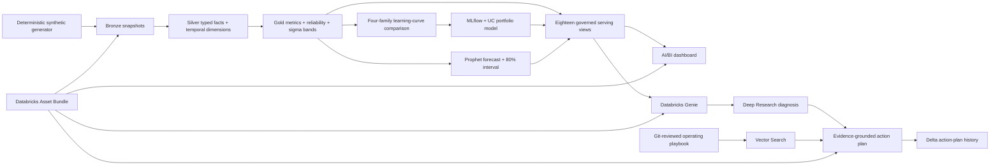

# Contact Center New-Hire Intelligence

An open-source Databricks analytics accelerator for measuring how quickly contact-
center cohorts become production-ready, quantifying the confidence behind that
conclusion, and converting validated findings into operational action plans.

The repository is the product: lakehouse code, ML governance, semantic metadata,
Genie configuration, AI/BI dashboard, workflows, evaluation, and operating
playbooks are version-controlled and deployed with a Databricks Asset Bundle.
The Databricks UI is only the runtime and presentation surface.

The repository provides two operating modes: a deterministic, privacy-safe fictional
demo and a customer adapter that maps existing Unity Catalog tables into documented
canonical contracts. The confidential design reference is excluded and never read by
either public path.

## Use it with your own data

Users configure four inputs—daily observations, agent assignments, KPI targets, and
training classes—without editing the governed analytics, ML, dashboard, or Genie
modules.

```powershell
python -m pip install -r requirements.txt
python scripts/project/cli.py init --output config/my-project.yml
# Edit table names and column mappings in config/my-project.yml
python scripts/project/cli.py validate --config config/my-project.yml
python scripts/project/cli.py build --config config/my-project.yml
```

The build is written to `build/<project-name>/` with the configured catalog, schemas,
feature resources, and generated Bronze adapter. Continue from that directory with
normal Databricks Asset Bundle validation and deployment. See the
[quickstart](docs/quickstart.md), [data contracts](docs/data_contracts.md), and
[configuration reference](docs/configuration.md).

## Demonstration evidence

Verified on 12 August 2026 in a clean Databricks development workspace: both the
demo and an independently generated customer-shaped source passed the
lakehouse/ML/serving acceptance run, all
12 live Genie benchmark questions passed their source-specific semantic gates,
and all 9 dashboard pages rendered against 16 governed datasets. Visual QA also
confirmed associative filtering, observed-versus-fitted learning curves, volume
progression, tenure and volume regression, process-control charts, outlier analysis,
forecast intervals, and pseudonymous agent drill-through. The full action-intelligence
workflow also passed, persisting an LLM action plan grounded in Genie Deep
Research and retrieved playbook chunks.

Workspace-specific URLs, object IDs, run IDs, and generated query payloads are
intentionally excluded. The public evidence contract is documented in
[validation results](docs/validation_results.md), and every deployable artifact is
reproducible from this repository.

The customer-mode proof processed 150,034 KPI facts through different source column
names and isolated schemas, selected 72 winners from 288 learning-curve candidates,
created 144 future forecast rows, and reached a zero-change bundle plan with the
dashboard, native Genie space, and four workflows managed as code.

## Dashboard tour

The bundled AI/BI dashboard is generated from code and deployed through the same
Databricks bundle as the lakehouse, workflows, and Genie space.

| Executive readiness | Learning and volume |
|---|---|
|  |  |
| **Lean Six Sigma process control** | **KPI drivers and regression** |
|  |  |

Screenshots use independently generated fictional customer data. Workspace and
account identifiers are runtime UI chrome rather than repository configuration.

## What it demonstrates

| Module | Engineering and analytics capability |
|---|---|
| Lakehouse | Deterministic synthetic ingestion, Bronze/Silver/Gold, SCD2 assignments, effective-dated KPI targets, weighted metrics, and data-quality gates |
| Statistics | Cohort-relative volume quartiles, cumulative volume, tenure/volume regression, z-score and IQR outliers, first-pass yield, DPMO, and direction-aware 1/2/3 sigma boundaries |
| Machine learning | Linear, logarithmic, exponential, and power curve comparison for every cohort/KPI; 480 candidate MLflow runs and one governed UC portfolio-model version containing 120 winners |
| Forecasting | Six-month Prophet forecasts with actual/future rows and 80 percent uncertainty intervals |
| Genie | Five governed sources, column metadata, instruction activation, examples, reusable filters/measures, and 12 executable benchmarks |
| AI/BI | Nine pages spanning executive readiness, grounded actions, learning and volume, regression, process control, outliers, cohorts, forecast, and agent drill-through |
| Action intelligence | Git-reviewed playbook generation, PDF/chunk artifacts, Vector Search retrieval, Genie Deep Research, and LLM-generated action plans persisted to Delta |
| Platform engineering | Declarative jobs, dashboard, and Genie resources; paused dev schedules; CI privacy, compilation, generator, and semantic validation gates |
| Open-source onboarding | Demo/customer modes, canonical data contracts, source-column mapping, local preflight validation, namespace rendering, and optional resource selection |

## Architecture



See [docs/architecture.md](docs/architecture.md) for object grains and workflow
dependencies.

## Repository structure

```text
.
|-- lakehouse/notebooks/              # Bronze -> Silver -> Gold -> ML -> serving
|-- contracts/                        # canonical customer input contracts
|-- examples/fictional_customer/      # independently generated BYOD clean-room proof
|-- adapters/                         # source-adapter extension guidance
|-- config/                           # demo and customer project configuration
|-- genie/
|   |-- config/                       # room identity and source routes
|   |-- context/                      # domain rules and table-selection knowledge
|   |-- source/                       # metadata, instruction library, active surface, benchmarks
|   `-- serialized/                   # bundle-deployable Genie artifact
|-- dashboard/                        # builder, brief, queries, and .lvdash.json
|-- action_intelligence/
|   |-- config/                       # cross-module RAG and action-plan contract
|   |-- notebooks/                    # index -> diagnose -> generate actions
|   `-- playbook_generator/           # blueprint, generator, Markdown/chunks/PDF
|-- infrastructure/
|   |-- databricks/resources/         # jobs, dashboard, Genie bundle resources
|   `-- environments/                 # credential-free local config example
|-- scripts/
|   |-- project/                      # init, validate, adapter, deployable build CLI
|   |-- genie/                        # materialize, serialize, evaluate, API fallback
|   `-- quality/                      # repository and privacy gates
|-- tests/                            # artifact-contract tests and live evidence guidance
|-- docs/                             # architecture, deployment, privacy, acceptance, demo
|-- databricks.yml                    # bundle entry point
`-- .github/workflows/ci.yml          # publication gates
```

## Deploy the fictional demonstration

Prerequisites are a Databricks workspace with Unity Catalog, Serverless Jobs,
AI/BI, Genie, a SQL warehouse, and an OAuth-authenticated Databricks CLI.

Run the local gates:

```powershell
python scripts/genie/materialize.py
python scripts/genie/build_space.py
python scripts/quality/validate_repository.py
python scripts/quality/privacy_scan.py
python dashboard/build_dashboard.py
python scripts/project/cli.py validate
```

Validate and deploy:

```powershell
databricks bundle validate --target dev --profile <profile> --var warehouse_id=<warehouse-id>
databricks bundle deploy --target dev --profile <profile> --var warehouse_id=<warehouse-id>
databricks bundle run bootstrap_portfolio --target dev --profile <profile> --var warehouse_id=<warehouse-id>
```

Generate the reviewed action playbook:

```powershell
$env:PYTHONUTF8 = "1"
python action_intelligence/playbook_generator/generate_playbook.py `
  --kit-format genie_kit --kit-root . `
  --config config/playbook_blueprint.yml `
  --output-dir action_intelligence/playbook_generator/generated
```

Full deployment and evaluation commands are in
[docs/deployment.md](docs/deployment.md).

## Project governance

- [Contributing](CONTRIBUTING.md)
- [Security policy](SECURITY.md)
- [Code of conduct](CODE_OF_CONDUCT.md)
- [Changelog](CHANGELOG.md)
- [Roadmap](docs/roadmap.md)
- [Troubleshooting](docs/troubleshooting.md)

## Quality and privacy contract

The project is not called complete merely because a deployment command succeeds.
Release gates cover keys, temporal joins, metric direction, denominator validity,
model candidate/winner counts, MLflow/registry lineage, forecast horizons,
interval ordering, serving-view rows, synthetic-label enforcement, Genie benchmark
behavior, and dashboard visual interaction.

- [Acceptance matrix](docs/acceptance.md)
- [Privacy boundary](docs/privacy.md)
- [Portfolio walkthrough](docs/portfolio_walkthrough.md)
- [Generated operating playbook](action_intelligence/playbook_generator/generated/contact_center_new_hire_ramp_action_playbook.md)

Licensed under the [MIT License](LICENSE).
