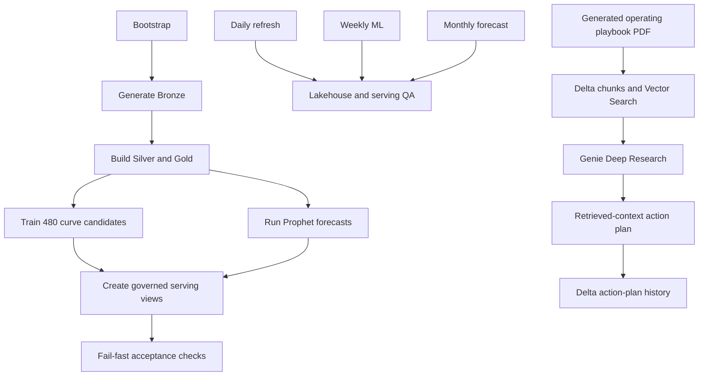

# Architecture and orchestration

## Data contracts

| Layer | Object | Grain | Purpose |
|---|---|---|---|
| Bronze | `bronze_agent_kpi_daily_raw` | agent x KPI x day | Synthetic source observations plus load lineage |
| Bronze | `bronze_agent_snapshot_raw` | agent x effective snapshot | Assignment history used to build SCD2 |
| Bronze | `bronze_kpi_target_raw` | program x cohort x KPI x target version | Effective-dated targets and display limits |
| Bronze | `bronze_training_class_raw` | cohort | Fictional curriculum and class reference |
| Silver | `dim_agent` | agent x validity interval | SCD Type 2 assignment history |
| Silver | `dim_kpi_target` | program x cohort x KPI x validity interval | Typed target history |
| Silver | `dim_training_class` | cohort | Deduplicated training reference |
| Silver | `fact_agent_kpi_daily` | agent x KPI x day | Typed, validated, temporally joined fact |
| Gold | `fact_agent_kpi_daily` | agent x KPI x day | Targets, sigma bands, cumulative volume, and reliability quartile |
| Gold | `kpi_results_inc_nh` | agent x KPI x month | New-hire monthly results |
| Gold | `kpi_results_exc_nh` | agent x KPI x month | Tenured comparison results |
| Gold | `kpi_monthly_baselines` | program x KPI x month | Rolling targets and sigma thresholds |
| Gold | `learning_curve_results` | program x cohort x KPI x candidate | Four candidates, one winner, interpretation, and lineage |
| Gold | `forecast_predictions` | program x KPI x month | Actual and six-month Prophet forecast rows |

## Serving contracts

Five narrow semantic views are exposed to Genie:

1. `mv_new_hire_kpi_daily`
2. `mv_learning_curve_best`
3. `mv_cohort_scorecard`
4. `mv_sigma_band_comparison`
5. `mv_kpi_forecast`

Thirteen additional governed views support AI/BI presentation and action visibility:

1. `mv_learning_curve_points` - day 30/60/90 selected-model points.
2. `mv_learning_curve_series` - observed and fitted daily target-index series.
3. `mv_ramp_volume_progression` - weekly and cumulative production exposure.
4. `mv_kpi_driver_relationship` - KPI, tenure, and volume observations.
5. `mv_kpi_driver_regression` - descriptive slopes, correlations, and fitted values.
6. `mv_tenure_regression_series` and `mv_volume_regression_series` - regression chart series.
7. `mv_process_control` and `mv_process_control_series` - direction-aware sigma evidence.
8. `mv_lean_six_sigma_summary` - opportunities, defects, first-pass yield, and DPMO.
9. `mv_agent_weekly_outliers` - peer z-score and IQR diagnostics.
10. `mv_kpi_forecast_series` - point, lower-80, and upper-80 series.
11. `mv_agent_target_series` - agent score, targets, volume, and cumulative volume.

`mv_action_intelligence_latest`, owned by the action workflow, exposes the latest
persisted grounded insight and recommendation. It falls back to the complete action
plan when the upstream response does not contain a separately parsed summary.

Keeping presentation reshaping in views prevents dashboard expressions from
reimplementing business logic.

## Workflow topology

Development schedules remain paused. Production enables the daily, weekly, and
monthly core schedules explicitly. The action-intelligence schedule remains paused
until its Vector Search and model-serving endpoints pass a manual run.

## Design decisions

- `normal = 1` means higher is better; `normal = -1` means lower is better.
- Scores aggregate as `SUM(nominator) / SUM(denominator)`; the source field keeps
  the legacy spelling while public documentation uses “numerator.”
- New-hire analysis uses tenure days 1-90; tenured benchmarks use tenure above 90.
- Agent assignments and KPI targets join by performance date within validity ranges.
- Percentage training targets use a 15 percentage-point adjustment; numeric targets
  use a 0.70 or 1.30 multiplier according to metric direction.
- Every curve candidate is an MLflow run. One UC portfolio-model version packages
  all winners and a selected-curve governance manifest, avoiding 120 registry objects.
- `question_category` is the stable contract linking action-playbook sources, seeded
  diagnosis questions, Vector Search filters, and expert prompts.
